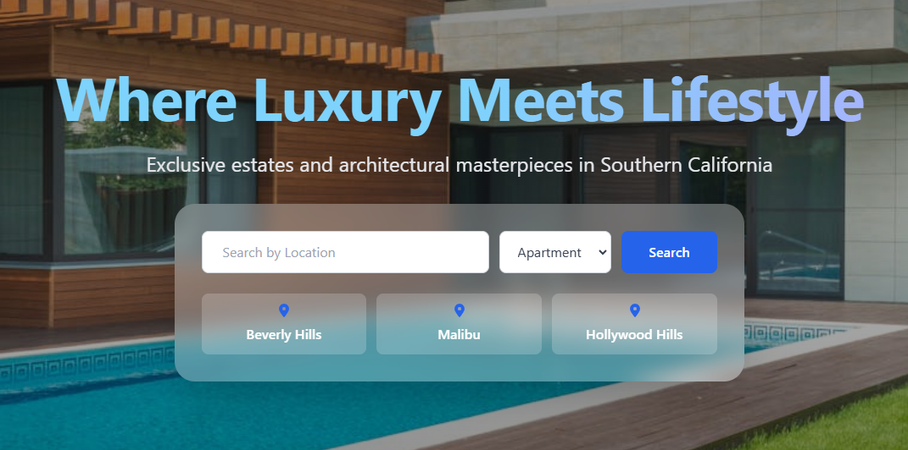
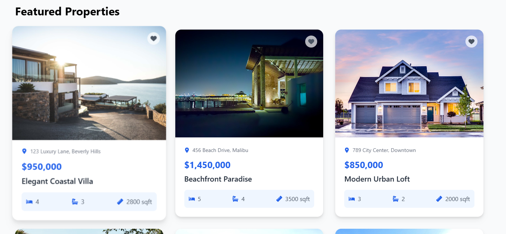
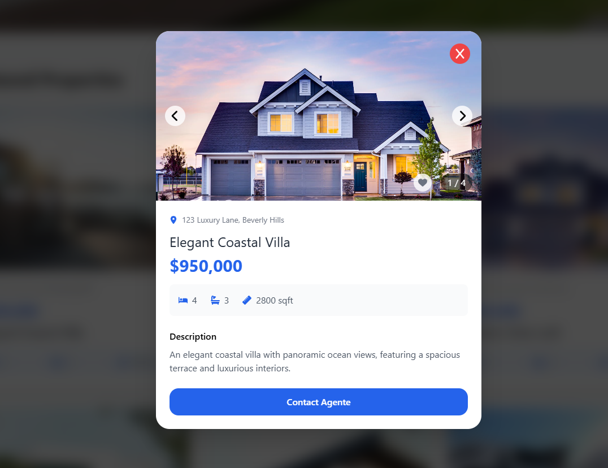
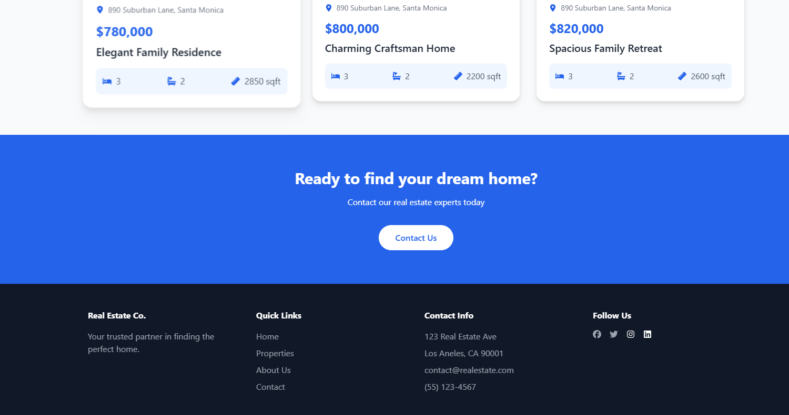

# 🏡 **SearchHome** 🚀

**Uma plataforma moderna e responsiva para venda de imóveis.**

Este projeto foi desenvolvido como parte de um estudo prático acompanhado através de um vídeo no **YouTube**. A aplicação utiliza tecnologias modernas para oferecer uma experiência rápida, intuitiva e visualmente atraente para compradores e vendedores de imóveis.

---

## 🔧 **Tecnologias Utilizadas**

As principais tecnologias utilizadas no projeto incluem:

- **⚛️ React.js:** Biblioteca JavaScript para construção de interfaces reativas.
- **⚡ Vite:** Ferramenta de build ultrarrápida para desenvolvimento moderno.
- **🎨 TailwindCSS:** Estilização rápida e responsiva com classes utilitárias.
- **🛡️ TypeScript:** Tipagem estática para maior robustez e manutenção do código.

---

## 🖥️ **Pré-requisitos**

Antes de começar, certifique-se de ter as seguintes ferramentas instaladas:

- [Node.js](https://nodejs.org/) (v16 ou superior)
- [Git](https://git-scm.com/)

---

## 🚀 **Como Executar o Projeto**

Siga as instruções abaixo para rodar o projeto localmente:

1. **Clone este repositório:**

   ```bash
   git clone https://github.com/gafredo/search-home.git
   cd search-home
   ```

2. **Instale as dependências:**

   ```bash
   npm install
   ```

3. **Inicie o servidor de desenvolvimento:**

   ```bash
   npm run dev
   ```

4. **Acesse no navegador:**
   ```
   http://localhost:5173
   ```

---

## 🌟 **Demonstração**






---

## 📜 **Licença**

Este projeto está sob a licença **MIT**.

---

## 📚 **Recursos de Estudo**

- 🎥 Vídeo Tutorial: [Link do vídeo do YouTube](https://www.youtube.com/watch?v=mUlfyK0Hhok)
- 📖 Documentação React: [React.js + Vite](https://vite.dev/)
- 📖 Documentação TailwindCSS: [TailwindCSS](https://tailwindcss.com/)
- 📖 Documentação TypeScript: [TypeScript](https://www.typescriptlang.org/)

---

## 🙌 **Agradecimentos**

Este projeto foi inspirado por um tutorial no YouTube. Agradecimentos ao criador do conteúdo.

---

## 🌐 **Conecte-se Comigo**

📧 **Email:** [gafredo@gmail.com](mailto:gafredo@gmail.com)  
💼 **LinkedIn:** [Gabriel Fredo](https://linkedin.com/in/gabriel-fredo-38211650)
